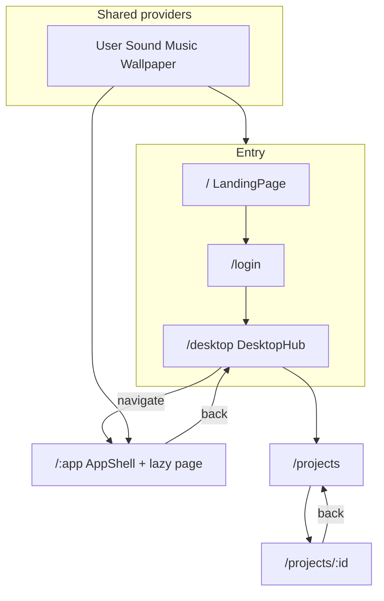

# Fullscreen Apps Redesign - Plan

## Goal Capsule

Replace the stacked mock-OS window manager with full-screen route pages, fix known functional bugs, and apply straightforward performance cuts while preserving the portfolio's desktop-hub identity.

**Authority:** User request (session) > this plan > existing code patterns. Prefer the existing dark OS visual language over a brand reboot.

**Stop when:** Apps open as dedicated full-screen URLs with only one content page mounted; listed bugs are fixed; always-on desktop effects are gated off app routes; unit + e2e tests pass for the new navigation model; README matches reality.

**Execution profile:** Code implementation via `ce-work` (or equivalent). Prefer smoke/runtime proof for shell/routing units; characterization-first for MusicPlayer and e2e login flow before rewriting expectations.

---

## Product Contract

### Summary

The site is a mock-OS personal portfolio. Today every app opens as a draggable/resizable window stacked on the desktop, which remounts heavy page trees on every drag frame and keeps multiple apps alive at once. This plan redesigns navigation so apps open as full-screen pages (routes), keeps a desktop/home hub for launching, fixes obvious broken assets and logic, and removes cheap performance waste.

### Problem Frame

Stacked windows look like an OS demo but cost real FPS: Window drag writes React state every `mousemove`, DesktopOS rebuilds every page element each render, GlassSurface + FallingParticles keep running under open apps, and all page modules are eagerly imported into the main chunk. Several features are also broken (window positioning double-offset, missing resume PDF, Deezer proxy gap, flaky e2e, incorrect album cover path).

### Requirements

- R1. Opening an app navigates to a dedicated full-screen page/route instead of stacking a floating OS window.
- R2. Closing or leaving an app returns to the desktop/home hub (or previous shell) without leaving orphan window state.
- R3. At most one portfolio content app is mounted at a time on desktop and mobile.
- R4. Landing → login/name → desktop entry flow remains reachable and completes reliably in automated tests.
- R5. Dock, desktop icons, terminal open-app commands, suggestions, and file-explorer mappings all open the same full-screen routes.
- R6. Project detail opens as a nested full-screen route (e.g. `/projects/:id`), not a cloned window element.
- R7. Fix known functional bugs: window position double-offset (removed with windows), broken resume PDF link, album cover path, fileToAppMap fallback, dock double-open sound, MobileLayout `whileTap` on plain button, MusicPlayer unit test providers/copy, Deezer local API reachability, e2e click/login timing.
- R8. Apply straightforward performance improvements: route-level code splitting, gate or remove always-on FallingParticles on app pages, stop SuggestionsCarousel autoplay under open apps (or remove from app routes), disable visualizer auto-open, drop unused heavy deps when safe, simplify/remove ineffective PreRender path if it adds no value.
- R9. Preserve the mock-OS visual identity for the hub (wallpaper, dock, desktop icons, menu bar cues) while giving app pages a full-bleed chrome with clear back/close-to-home control.
- R10. Update unit tests, Playwright e2e, and README so documented structure and interactions match the shipped UX.

### Actors

- A1. Visitor — browses portfolio through landing, login, desktop hub, and app pages.
- A2. Implementer / CI — runs Vitest and Playwright; expects stable selectors and routes.

### Key Flows

- F1. Entry to hub
  - **Trigger:** Visitor loads `/`
  - **Actors:** A1
  - **Steps:** Landing completes → login/name → navigate to desktop hub route
  - **Outcome:** Hub visible with icons/dock; no content app mounted yet
  - **Covered by:** R4, R9

- F2. Open app full screen
  - **Trigger:** Click dock item, desktop icon, suggestion, or terminal command
  - **Actors:** A1
  - **Steps:** Navigate to `/about` (or peer route); hub chrome replaced or overlaid by full-screen app shell; page lazy-loads
  - **Outcome:** Single full-screen app; URL shareable/refreshable for that app
  - **Covered by:** R1, R3, R5, R8

- F3. Leave app
  - **Trigger:** Back/close control or navigate home
  - **Actors:** A1
  - **Steps:** Navigate to hub route; app unmounts
  - **Outcome:** Hub restored; no window stack residual
  - **Covered by:** R2, R3

- F4. Open project detail
  - **Trigger:** Select a project from Projects
  - **Actors:** A1
  - **Steps:** Navigate to `/projects/:id` full screen
  - **Outcome:** Detail page only; closing returns to `/projects` or hub (implementer picks one and documents it)
  - **Covered by:** R6

### Acceptance Examples

- AE1. Covers F2 / R1. Given the desktop hub, when the visitor clicks About, then the URL becomes `/about`, About content fills the viewport, and no floating window chrome with drag handles is present.
- AE2. Covers F3 / R2. Given `/projects`, when the visitor activates close/back-to-home, then the URL is the hub route and Projects is unmounted.
- AE3. Covers R7. Given MusicPlayer favorites, when album art for the Moo track renders, then it loads `/Moo.png` successfully.
- AE4. Covers R4 / R10. Given a cold Playwright run, when the suite boots through landing/login, then it reaches the hub without relying on brittle fixed double-click + 2s sleeps alone.

### Success Criteria

- Apps are route pages, not stacked windows.
- Main-bundle no longer eagerly ships every page component.
- Listed bugs in R7 are gone or explicitly deferred with reason.
- `npm run test:run` and `npm run test:e2e` pass (or e2e skip only with documented env blocker).
- README describes routes, not StartMenu/FontDemo phantoms.

### Scope Boundaries

**In scope**
- Router introduction and route map for entry + apps + project detail
- Retirement of multi-window WindowContext stacking / drag / resize / z-index
- Full-screen app shell redesign (hub preserved, app pages full-bleed)
- Bug fixes listed in R7
- Straightforward perf cuts listed in R8
- Test + README alignment

**Out of scope**
- Full brand reboot / new color system unrelated to the OS identity
- Rebuilding File Explorer into a real filesystem browser (keep stub or redirect to hub Files affordance)
- New content writing for About/Projects/etc. beyond layout wrappers needed for full-screen
- Spotify proxy revival
- Three.js scene work beyond existing LiquidEther on login
- PWA / SSR / Next.js migration

### Deferred to Follow-Up Work

- Rich File Explorer implementation
- Optional deep-link skip of landing for returning visitors
- GSAP SplitText Club plugin licensing fallback if landing blocks progression in some environments
- Media asset compression pass for large wallpapers / Paradise.mp3

---

## Planning Contract

### Assumptions

Headless planning run — scoping confirmation skipped. Inferred bets recorded here:

- Keep the desktop hub as a first-class route (e.g. `/desktop` or `/home`) after login; do not jump straight into a random app.
- Preserve existing dark teal/emerald OS aesthetic; redesign means architecture + shell polish + clutter reduction, not a new brand.
- Install React Router for SPA routes (`react-router` / compatible DOM bindings). Prefer declarative `BrowserRouter` + nested `Routes`/`Outlet` with `React.lazy` — portfolio pages need no loaders.
- Mobile and desktop share the same routes; responsive layout lives in shared shells rather than parallel WindowContext trees.
- Music continues globally via `MusicContext` across route changes (audio should not stop solely because the Music Player route unmounted) unless current product behavior already stops on unmount — preserve whichever is less surprising after checking `MusicContext`.
- File Explorer dock entry either routes to a minimal page or opens the same Files affordance; do not rebuild the stub in this plan.
- Visual redesign of content sections is limited to full-screen layout chrome and removing window-only affordances; keep page internals unless they break in full-screen.

### Key Technical Decisions

- KTD1. **Replace window stack with URL routes.** session-settled: user-directed — chosen over keeping stacked OS windows. Rationale: user asked for full-screen pages to preserve performance; stacked windows remount/rebuild content under drag and keep N apps alive.
- KTD2. **Hub + full-screen app layout pattern.** `/` landing, `/login`, `/desktop` hub; app routes like `/about`, `/projects`, `/projects/:id`, `/resume`, `/contact`, `/awards`, `/leadership`, `/terminal`, `/music`, `/wallpaper`, `/suggestions`, `/explorer`. App routes render a shared `AppShell` (title, back/close) with `<Outlet />`. Rejected: keep Window chrome and only maximize by default (still pays multi-mount + GlassSurface cost).
- KTD3. **Lazy page modules at the route boundary.** Use `React.lazy(() => import(...))` (or router `lazy`) so Vite splits chunks. Eager `apps` registry in `App.jsx` must stop importing every page component at top level — registry becomes id/meta + lazy loader.
- KTD4. **Retire WindowContext multi-window API** (open/minimize/maximize/z-index/drag/resize) once routes land. Dock "isOpen" becomes path match. Terminal `onOpenApp` becomes `navigate`. Projects `onOpenWindow` / `cloneElement` project-detail path becomes nested route.
- KTD5. **Gate always-on effects to hub only.** FallingParticles and SuggestionsCarousel mount on `/desktop` (and maybe login), not under app routes. ClickSparkCursor optional on hub only.
- KTD6. **Bugfix batch rides the same PR sequence after routing skeleton.** Fixes that depend on windows disappearing (double position) come free; asset/API/test fixes remain explicit units.
- KTD7. **Add Vite dev proxy for `/api/deezer` → local handler or upstream**, so MusicPlayer search works outside Vercel. Prefer proxy to existing `api/deezer.js` behavior or a small Express stub already hinted by package scripts — pick the smallest local path that returns JSON the page already expects.

### Alternative Approaches Considered

| Approach | Pros | Cons | Verdict |
|----------|------|------|---------|
| A. Routes + hub (chosen) | One mounted app; shareable URLs; natural code-split | Loses multi-window demo novelty | **Choose** — matches user perf goal |
| B. Keep windows, always maximize, hide inactive | Smaller code change | Still remounts on drag state; GlassSurface N; no URLs | Reject |
| C. Migrate to Next.js App Router | Framework splitting/SSR | Out of scope rewrite | Reject / defer |

### High-Level Technical Design

Desktop hub keeps wallpaper + dock + icons. AppShell is full-viewport content with a compact top bar (traffic-light close → hub, title, optional maximize N/A). Mobile uses the same routes; `MobileLayout` becomes the hub UI at `/desktop` when viewport is narrow, not a second window manager.

### Implementation Constraints

- Repo-relative paths only in implementer notes.
- Do not hardcode test assertions that invent new copy — pull visible strings/selectors from components under test.
- Preserve existing design-system cues (GlassSurface on hub controls is fine; avoid wrapping every full-screen page in heavy SVG displacement filters).
- No exploit/malware work; Deezer proxy is a same-origin forwarder only.

### Sequencing

1. Router + route map + providers (U1)
2. Hub launchers → navigate; retire window stack (U2)
3. AppShell visual redesign + effect gating (U3)
4. Bug fixes + Vite proxy + dependency cleanup (U4)
5. Tests + README (U5)

---

## Implementation Units

### U1. Introduce router and route map

**Goal:** Add SPA routing for landing, login, desktop hub, and placeholder/lazy app routes without yet deleting all window code if a thin compatibility shim eases migration — but prefer clean cut if cheaper.

**Requirements:** R1, R4, R6

**Dependencies:** None

**Files:**
- `package.json` (add `react-router` / DOM bindings)
- `src/main.jsx`
- `src/App.jsx` (or split `src/routes.jsx`, `src/layouts/DesktopHub.jsx`, `src/layouts/AppShell.jsx`)
- `src/pages/*` (default exports remain; may add thin route wrappers)

**Approach:**
- Install current React Router package compatible with React 19 + Vite 7.
- Wrap app in `BrowserRouter` (or `RouterProvider` if using data router). Prefer declarative routes because pages are static.
- Map entry flow from `currentPage` state to routes; login success `navigate('/desktop')`.
- Register lazy routes for each app id; Suspense fallback is a simple full-screen loader matching dark theme.
- Nested route for `/projects/:id`.

**Patterns to follow:** Existing lazy pattern in `LoginPage.jsx` for LiquidEther; provider nesting in `App.jsx`.

**Test scenarios:**
- Happy: visiting `/desktop` after login flow renders hub markers (About/Projects labels).
- Happy: visiting `/about` renders About content full screen.
- Edge: unknown path shows a minimal not-found or redirect to hub.
- Integration: refresh on `/resume` still shows Resume (providers wrap router).

**Verification:** Dev server navigation works for hub and at least two app routes; build succeeds.

**Execution note:** Prefer runtime smoke after wiring routes before deleting WindowContext.

---

### U2. Retire window stack; wire all launchers to navigate

**Goal:** Remove multi-window open/drag/resize/z-index behavior; Dock, icons, Terminal, Suggestions, MobileLayout, Projects all navigate.

**Requirements:** R1, R2, R3, R5, R6

**Dependencies:** U1

**Files:**
- `src/contexts/WindowContext.jsx` (delete or gut)
- `src/contexts/useWindows.js` (delete or replace)
- `src/components/Window.jsx` (delete or replace with AppShell chrome)
- `src/App.jsx`
- `src/components/Dock.jsx`
- `src/components/MenuBar.jsx`
- `src/components/GlassIcons.jsx` / desktop hub
- `src/components/MobileLayout.jsx`
- `src/components/Terminal.jsx`
- `src/components/SuggestionsCarousel.jsx`
- `src/pages/Suggestions.jsx`
- `src/pages/Projects.jsx`
- `src/components/ProjectDetail.jsx`
- `src/components/FileExplorer.jsx` (routing only)

**Approach:**
- Replace `handleAppClick` / `openWindow` with `navigate(\`/${app.id}\`)`.
- Dock active state: `useLocation().pathname.startsWith(...)`.
- Close control: `navigate('/desktop')`.
- Projects: `navigate(\`/projects/${id}\`)` instead of `onOpenWindow` + `cloneElement`.
- Fix `fileToAppMap` fallback to resolve **values** (app types), not keys; map file opens to `navigate`.
- Wire or remove dead `onOpenFolder` path in Projects.
- Delete unused window-only code paths once no callers remain.

**Patterns to follow:** Current `apps` registry shape (id/type/label/icon); keep a single source of truth for app metadata.

**Test scenarios:**
- Happy: dock click changes location and mounts one page.
- Happy: terminal open-app command navigates to the matching route.
- Happy: project card opens `/projects/:id`.
- Edge: clicking an already-open app’s dock icon focuses/stays on that route (no duplicate stack).
- Integration: mobile hub app tap uses same routes as desktop.

**Verification:** No `WindowProvider` consumers left (or shim unused); grep shows no `openWindow` / `updateWindowPosition` call sites; manual open/close of three apps works.

---

### U3. Full-screen AppShell redesign and effect gating

**Goal:** Deliver the visible redesign of app presentation (full-bleed page chrome) and cut always-on effects off the critical path when an app is open.

**Requirements:** R8, R9

**Dependencies:** U2

**Files:**
- `src/layouts/AppShell.jsx` (create) or equivalent in `src/components/`
- `src/App.css` / `src/index.css` (shell tokens only as needed)
- `src/components/FallingParticles.jsx` (mount site)
- `src/components/SuggestionsCarousel.jsx` (mount site)
- `src/components/ClickSparkCursor.jsx` (mount site)
- `src/contexts/PreRenderContext.jsx` (simplify/remove if proven useless)
- `src/components/GlassSurface.jsx` (usage sites — avoid full-page wrap)

**Approach:**
- AppShell: full viewport, compact top bar with close→hub, title from route meta, content scroll region; no drag/resize; prefer light backdrop (wallpaper dim or solid) over per-page GlassSurface SVG filters.
- Hub retains wallpaper, dock, icons, menu bar.
- Mount FallingParticles / SuggestionsCarousel / ClickSpark only on hub (and login if desired).
- Evaluate PreRenderContext: if it only delays first paint theatrically, remove provider and simplify consumers to render immediately.
- Keep 2–3 intentional motions (route enter/exit opacity or short spring) — avoid motion noise.

**Patterns to follow:** Existing MenuBar/Dock visual language; avoid purple/glow AI-default looks; preserve teal/gold accents already in CSS vars.

**Test scenarios:**
- Happy: app route has a visible back/close control that returns to hub.
- Happy: hub still shows particles (if kept); app route does not run FallingParticles canvas (assert via absence of particle canvas or by mount structure).
- Test expectation for pure styling: none beyond smoke — visual check at desktop and mobile widths.

**Verification:** App pages feel full-screen; Chrome performance: no particle canvas under `/about`; route transitions do not jank hub dock.

---

### U4. Bug fixes and straightforward build/runtime perf cleanup

**Goal:** Clear remaining R7 bugs and easy package/build wins that do not depend on more architecture debate.

**Requirements:** R7, R8

**Dependencies:** U1 (proxy), U2 (some bugs obsolete)

**Files:**
- `src/pages/Resume.jsx` (PDF href — add asset under `public/` or fix path to an existing file)
- `src/pages/MusicPlayer.jsx` (`/Moo.png`)
- `src/pages/MusicPlayer.test.jsx`
- `src/components/MobileLayout.jsx` (`motion.button` for `whileTap`)
- `src/components/Dock.jsx` (single open sound)
- `src/components/Window.jsx` (removed in U2 — double position dies with it)
- `vite.config.js` (Deezer proxy; visualizer `open: false`)
- `api/deezer.js` (reference for proxy target)
- `package.json` (remove unused deps if unused: `@react-three/*`, `maath`, `use-sound`, unused `motion` package if distinct from framer-motion; remove broken `spotify-proxy` script or restore file — prefer remove script)
- `public/` as needed for resume PDF

**Approach:**
- Fix asset paths; ensure resume download target exists or hide broken CTA.
- Wrap MusicPlayer tests with required providers; align empty-state assertion with component string **from the component**.
- Dev-server proxy `/api/deezer` so local search works.
- Drop dead dependencies only after grep confirms zero imports.
- Do not invent new MusicPlayer empty-state copy in tests.

**Patterns to follow:** Existing `SoundContext.test.jsx` provider wrapping; Vercel `api/deezer.js` request/response shape.

**Test scenarios:**
- Happy: MusicPlayer test renders under MusicProvider without throw.
- Happy: Moo favorite image `src` is `/Moo.png`.
- Happy: Deezer search in dev hits proxied `/api/deezer` (mock network or smoke).
- Error: missing resume asset — either file present or button not linking 404.
- Edge: dock open sound fires once per open.

**Verification:** `npm run test:run` green for touched tests; `npm run build` does not auto-open stats.html; bundle analyzer file may still emit to `dist/stats.html`.

**Execution note:** Characterization-first for MusicPlayer tests — observe current failure, then fix providers/assertions against real UI strings.

---

### U5. Align e2e suite and README with route-based UX

**Goal:** Make automated entry + app open reliable; documentation matches the redesign.

**Requirements:** R4, R10

**Dependencies:** U2, U3, U4

**Files:**
- `e2e/app.spec.js`
- `e2e/music-player.spec.js`
- `README.md`
- optionally `playwright.config.js` if baseURL/timeouts need tuning

**Approach:**
- Replace dblclick with single click; wait on URL (`/desktop`, `/music`) and role/text from real UI instead of fixed multi-second sleeps where possible.
- Stabilize login/name: explicit waits for Login button → name field → hub landmark.
- Rewrite README: remove Font Demo / StartMenu / Taskbar / DesktopIcon / Google Font list fiction; document routes, env keys, scripts that exist.
- Keep tests pulling locators from visible labels already in components.

**Test scenarios:**
- Happy: e2e reaches hub and opens Music via single click; URL is `/music`.
- Happy: desktop icons visible on hub.
- Integration: music search test skips gracefully or mocks API if proxy unavailable — document choice in test.
- Edge: landing-only test does not require full desktop boot if isolated.

**Verification:** `npm run test:e2e` passes locally in this environment (or failures are env-only and called out); README structure section lists real files.

---

## Verification Contract

| Gate | Command / check | Proves |
|------|-----------------|--------|
| Unit | `npm run test:run` | MusicPlayer/SoundContext and any new route helper tests |
| Lint | `npm run lint` | No new eslint errors in touched files |
| Build | `npm run build` | Route lazy splits; visualizer does not block CI with `open: true` |
| E2E | `npm run test:e2e` | Entry flow + open app via routes |
| Manual smoke | Dev: hub → open About/Projects/Music → back → project detail | R1–R6, R9 |
| Perf smoke | Confirm no FallingParticles canvas on app route; network tab shows separate page chunks | R8 |

**Behavioral skill evaluation:** not required (no agent/tool surface).

**Release validate:** not applicable (static Vite portfolio).

---

## Definition of Done

- All Implementation Units U1–U5 complete with their verification outcomes.
- Product requirements R1–R10 satisfied or explicitly deferred under Scope Boundaries with reason.
- Window stacking APIs gone from runtime path; apps are full-screen routes.
- Obvious bugs in R7 fixed.
- Tests and README updated; no abandoned half-router / half-window dual systems left in `src/`.
- Abandoned experiment code from implementation attempts removed from the diff.

---

## Risks & Dependencies

| Risk | Mitigation |
|------|------------|
| GSAP SplitText Club plugin blocks landing → login in some installs | E2E should timeout-fail clearly; consider try/catch fallback calling `onComplete` if already partially present — only if reproduced |
| Music audio UX across unmount | Inspect `MusicContext` before deciding stop-vs-continue; document choice in AppShell notes |
| Deezer CORS/API key behavior differs local vs Vercel | Proxy mirrors `api/deezer.js`; e2e mocks search if needed |
| Large PR touching shell + tests | Keep unit order U1→U5; prefer incremental commits per unit |

**External research (load-bearing):** React Router v7 route-level `lazy` / Vite code-splitting guidance informed KTD3 ([React Router route `lazy`](https://reactrouter.com/7.6.1/start/data/route-object)); portfolio needs no loaders, so declarative + `React.lazy` is sufficient.

---

## System-Wide Impact

- **Navigation model:** state machine → URL; refresh/deep-link behavior changes (apps become bookmarkable).
- **Performance posture:** one mounted app; hub-only particles; smaller initial JS.
- **Tests:** Playwright selectors and interaction model change from windows to routes.
- **Docs:** README becomes source of truth again.

---

## Open Questions

None blocking. Deferred non-blocking items live under Scope Boundaries → Deferred to Follow-Up Work.

---

## Sources & Research

- Codebase exploration of `src/App.jsx`, `src/contexts/WindowContext.jsx`, `src/components/Window.jsx`, `MobileLayout.jsx`, `FallingParticles.jsx`, `LoginPage.jsx`, `vite.config.js`, e2e specs, `package.json`
- Evidence: double `x/y` + `left/top` positioning in `Window.jsx`; eager page imports in `App.jsx`; no `react-router` usage; Deezer path `/api/deezer` without Vite proxy; README/feature drift
- React Router lazy route docs (external, load-bearing for KTD3)
