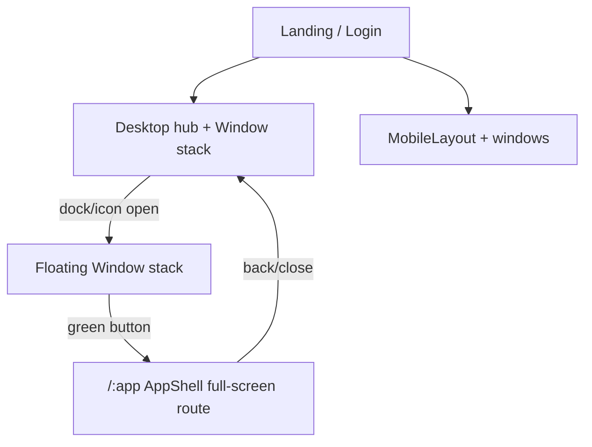

# Fullscreen Apps Redesign - Plan

## Goal Capsule

Keep the stacked mock-OS window system. Make the green traffic-light control open the app as a dedicated full-screen page (route) for focused/perf use. Fix known bugs and apply straightforward performance improvements to the floating-window path. Small screens keep the existing window/`MobileLayout` model.

**Authority:** User request (session) > this plan > existing code patterns. Prefer the existing dark OS visual language over a brand reboot.

**Product Contract preservation:** Corrected after user clarification — prior drafts wrongly retired stacked windows. Intent is: stacked windows remain; green button → full-screen page. R1–R11 rewritten in place to match.

**Stop when:** Dock/icons still open stacked floating windows; green button opens a full-screen app route and leaves the costly multi-window mount for that app; returning from full-screen restores the desktop hub (other windows preserved as specified); listed bugs fixed; drag/render perf wins landed; tests + README match.

**Execution profile:** Code via `ce-work`. Characterization-first for Window drag/maximize behavior and MusicPlayer/e2e before rewriting expectations.

---

## Product Contract

### Summary

This is a mock-OS portfolio. Apps open as stacked floating windows. The green title-bar button today only toggles in-window maximize and still keeps the heavy window tree on the desktop. This plan rewires **green → full-screen page route**, keeps red/yellow/close/minimize/stacking, fixes obvious bugs, and cuts easy performance waste (especially drag-induced re-renders and eager imports).

### Problem Frame

Floating windows are the product identity, but they are expensive when content remounts every drag frame, every open window stays mounted with GlassSurface, and all pages are eagerly imported. Users still want stacking; they want the green control to escape into a lighter full-screen page experience.

### Requirements

- R1. Opening an app from dock, desktop icons, terminal, suggestions, or file mappings still opens (or focuses) a **stacked floating window** on large screens. session-settled: user-directed — chosen over replacing open with navigate.
- R2. The **green** traffic-light control on a desktop window opens that app as a **full-screen page/route** (not merely CSS maximized-in-place). session-settled: user-directed — this is the "open in new pages on full screen" intent.
- R3. Leaving the full-screen page (back/close) returns to the desktop hub. Floating windows that were open should still be present unless the implementer documents a deliberate "promote closes the floater" rule (default: **close or minimize the floater for that app when entering full-screen** so its content is not double-mounted; other apps' windows remain).
- R4. Landing → login/name → desktop/mobile entry remains reachable and stable in automated tests.
- R5. Red closes; yellow minimizes; stacking, focus/z-index, and drag/resize remain for floating windows (with perf fixes).
- R6. Project detail may open as a floating window or nested full-screen route; green on a Projects window (or a detail window) can promote to `/projects` or `/projects/:id` full-screen. Prefer nested route for detail when promoted.
- R7. Fix known bugs: window position double-offset (`x/y` + `left/top`), broken resume PDF link, album cover path, `fileToAppMap` fallback, dock double-open sound, MobileLayout `whileTap` on plain button, MusicPlayer unit test providers/copy, Deezer local API reachability, e2e click/login timing.
- R8. Straightforward perf: stop recreating page elements on every DesktopOS render during drag; lazy-load page modules; gate or lighten always-on effects when sensible; visualizer `open: false`; drop unused heavy deps; reconsider PreRender; full-screen route mounts only that app's page (desktop compositor unmounted or idle underneath).
- R9. Preserve mock-OS visual identity (wallpaper, dock, icons, menu bar, traffic lights). Full-screen page uses simple full-bleed chrome with back-to-desktop.
- R10. Update unit/e2e/README for: stacked open, green→route, mobile windows.
- R11. Small screens (`innerWidth < 768`) keep `MobileLayout` + `WindowContext` windows. session-settled: user-directed. Green-equivalent promote-to-route on mobile is **optional/out of scope** unless cheap; do not remove mobile windows.

### Actors

- A1. Visitor — uses stacked windows and optional full-screen promote.
- A2. Implementer / CI — Vitest + Playwright.

### Key Flows

- F1. Entry to hub
  - **Trigger:** Load `/`
  - **Steps:** Landing → login/name → desktop or mobile shell
  - **Outcome:** Hub ready
  - **Covered by:** R4, R9

- F2. Open stacked window (large screen)
  - **Trigger:** Dock/icon/terminal/suggestion click
  - **Steps:** `openWindow` / restore / bringToFront as today
  - **Outcome:** Floating window in the stack; multiple apps may be open
  - **Covered by:** R1, R5

- F3. Green → full-screen page
  - **Trigger:** Click green traffic light on a floating window
  - **Steps:** Navigate to `/<appId>` (or `/projects/:id`); unmount that floater's content (close/minimize that window); render AppShell + lazy page full screen
  - **Outcome:** Focused full-screen app; other floaters remain on desktop underneath/when returning
  - **Covered by:** R2, R3, R8

- F4. Exit full-screen page
  - **Trigger:** Back/close on AppShell
  - **Steps:** Navigate to desktop hub route (or prior desktop state)
  - **Outcome:** Desktop with remaining stacked windows visible
  - **Covered by:** R3

- F5. Small-screen open
  - **Trigger:** Tap app on `MobileLayout`
  - **Steps:** Existing window overlay path
  - **Outcome:** Mobile windows preserved
  - **Covered by:** R11

### Acceptance Examples

- AE1. Covers F2 / R1. Given desktop hub, when visitor clicks About, then a floating About window opens (stackable with others), URL may stay on desktop hub.
- AE2. Covers F3 / R2. Given an open About floating window, when visitor clicks the green control, then URL becomes `/about`, About is full-bleed, and About is not also mounted as a floating window content tree.
- AE3. Covers F4 / R3. Given `/about` full-screen with a Projects floater previously open, when visitor returns to desktop, then Projects floater is still available.
- AE4. Covers R7. Moo favorite cover loads `/Moo.png`.
- AE5. Covers R4 / R10. Playwright reaches hub without brittle dblclick-only assumptions.
- AE6. Covers F5 / R11. Small viewport opens apps via `MobileLayout` windows.

### Success Criteria

- Stacked floating windows still work on desktop.
- Green promotes to full-screen route without double-mounting that app.
- Drag no longer rebuilds all page trees every mousemove.
- R7 bugs fixed; R8 wins landed; README accurate.

### Scope Boundaries

**In scope**
- Keep WindowContext stacked windows on desktop
- Rewire green maximize → full-screen route + AppShell
- Perf fixes for floating path (drag renders, lazy pages)
- Bug fixes in R7
- Small-screen windows retained
- Tests + README

**Out of scope**
- Removing stacked windows / forcing all opens to routes
- Full brand reboot
- Real File Explorer rebuild
- Spotify proxy revival
- Required mobile green→route (optional follow-up)
- Next.js / SSR migration

### Deferred to Follow-Up Work

- Mobile green/promote-to-route
- Rich File Explorer
- Returning-visitor skip landing
- GSAP SplitText fallback if landing blocks
- Media asset compression

---

## Planning Contract

### Assumptions

Corrected after user clarification (green button = full-screen page; keep stacking):

- Breakpoint remains `768px`.
- Full-screen routes live alongside the desktop hub (e.g. `/desktop` hub + `/about`, `/projects`, …). Entry landing/login can stay state-based or become routes — prefer routes for deep-linkable full-screen apps at minimum.
- Default on green: **close the floating window for that app** when promoting so content is not mounted twice; other windows stay in `windows[]`.
- In-place CSS maximize (old green toggle) is replaced by promote-to-route; if restore-from-maximize was useful, full-screen back button covers "exit full screen".
- Shared lazy page factories feed both Window content and route Outlet.
- MusicContext behavior across promote/unmount: inspect and preserve least-surprising audio continuity.

### Key Technical Decisions

- KTD1. **Keep stacked floating windows as the default open path.** session-settled: user-directed — chosen over "all opens are routes".
- KTD2. **Green traffic light navigates to a full-screen app route** and drops that floater's mounted content. session-settled: user-directed — chosen over in-place `maximized` flag only.
- KTD3. **Add React Router** for full-screen app pages (+ optional hub/login routes). Declarative router + `React.lazy` is enough (no loaders).
- KTD4. **Fix Window positioning to use either transform or `left/top`, not both**; fix drag so position updates do not recreate every `<app.component />` (store type in window state; render content from registry by type; memoize Window; consider dragging via refs/transforms without React state every pixel).
- KTD5. **Keep `WindowContext` for desktop stack + mobile.** Do not delete window APIs.
- KTD6. **Gate expensive ambient effects** where cheap (e.g. pause SuggestionsCarousel autoplay while many windows open or while on a full-screen route; particles optional under full-screen route).
- KTD7. **Bug/proxy/deps cleanup** in the same delivery sequence.
- KTD8. **Small screens keep windows** (R11). session-settled: user-directed.

### Alternative Approaches Considered

| Approach | Pros | Cons | Verdict |
|----------|------|------|---------|
| A. Stacked windows + green→full-screen route (chosen) | Keeps OS demo; opt-in perf focus mode | Two presentation modes | **Choose** — matches user clarification |
| B. All opens are routes (prior draft) | Max perf | Kills stacking | Reject — user redirected |
| C. Green only CSS-maximizes in place | Tiny change | Still mounts on desktop with GlassSurface/particles | Reject — not "new pages" |

### High-Level Technical Design

`Window.jsx` green `onClick` calls `promoteToFullscreen(appType)` → `closeWindow(id)` (or minimize) + `navigate(\`/${appType}\`)`. DesktopOS still maps `windows` to `<Window />`. Full-screen route renders outside the window map.

### Implementation Constraints

- Repo-relative paths only.
- Never hardcode test copy — pull from components.
- Preserve traffic-light affordances; green meaning changes to "Open full screen page".
- Deezer proxy is same-origin forwarder only.

### Sequencing

1. Router + full-screen routes + AppShell (U1)
2. Wire green → promote; keep open=window (U2)
3. Floating-window perf + position bug (U3)
4. Other bugs, proxy, deps (U4)
5. Tests + README (U5)

---

## Implementation Units

### U1. Add full-screen routes and AppShell

**Goal:** Introduce router + lazy full-screen app routes with a simple AppShell (back to desktop), without removing floating windows.

**Requirements:** R2, R3, R4, R9

**Dependencies:** None

**Files:**
- `package.json`
- `src/main.jsx`
- `src/App.jsx` / `src/routes.jsx`
- `src/layouts/AppShell.jsx` (create)
- `src/pages/*` (lazy boundaries)

**Approach:**
- Add React Router.
- Routes for `/about`, `/projects`, `/projects/:id`, `/resume`, etc., plus desktop hub path.
- AppShell: full-bleed, back/close → desktop hub.
- Landing/login can move onto routes or stay local state initially; full-screen apps must be routable.

**Patterns to follow:** Existing LiquidEther `lazy` pattern; provider nesting.

**Test scenarios:**
- Happy: visit `/about` shows About full screen with back control.
- Happy: back returns to desktop hub.
- Edge: unknown path → hub or not-found.
- Integration: providers wrap router so Music/Wallpaper still work on full-screen pages.

**Verification:** Manual navigate to two app routes works; build succeeds.

**Execution note:** Smoke routes before rewiring green.

---

### U2. Green promotes to full-screen; opens stay stacked windows

**Goal:** Dock/icons still `openWindow`. Green calls promote-to-route. Mobile unchanged.

**Requirements:** R1, R2, R3, R5, R6, R11

**Dependencies:** U1

**Files:**
- `src/components/Window.jsx`
- `src/contexts/WindowContext.jsx` (optional `promote` helper)
- `src/App.jsx`
- `src/components/Dock.jsx`
- `src/components/Terminal.jsx`
- `src/pages/Projects.jsx` / `src/components/ProjectDetail.jsx`
- `src/components/MobileLayout.jsx`

**Approach:**
- Replace green `onMaximize` in-place toggle with `onPromoteFullscreen` → close/minimize this window + `navigate` to app route.
- Update button title/tooltip to "Full screen" / "Open as page".
- Keep red/yellow/stacking.
- Desktop open paths remain `openWindow`.
- Mobile: no required promote; keep windows.

**Patterns to follow:** Existing traffic-light UI in `Window.jsx`; `useWindows` API.

**Test scenarios:**
- Happy: open About + Projects as two floaters.
- Happy: green on About → `/about` full screen; Projects floater still in state for return.
- Happy: back from `/about` shows desktop with Projects window.
- Edge: green on already-only-window still works.
- Integration: AE6 mobile window open unaffected.

**Verification:** Grep shows green path uses navigate; dock open still uses openWindow.

---

### U3. Floating window performance and position fix

**Goal:** Fix double position bug and stop drag from rebuilding all app trees every frame.

**Requirements:** R7 (position), R8

**Dependencies:** U2 helpful but can parallel after U1 if needed; prefer after U2.

**Files:**
- `src/components/Window.jsx`
- `src/App.jsx`
- `src/contexts/WindowContext.jsx`
- optionally window unit test under `src/components/Window.test.jsx`

**Approach:**
- Use **either** framer `x/y` **or** CSS `left/top`, not both.
- Store `type` on window records; render `<app.component />` from type inside Window (or memoized child) so DesktopOS re-renders do not clone new element trees unnecessarily.
- Prefer dragging via ref/transform with `onDragEnd` committing position once, or throttle React position updates.
- Lazy-load page modules used by both Window and routes.

**Patterns to follow:** React 19 / existing Window drag effect; avoid adding useMemo unless needed — structural fix preferred.

**Test scenarios:**
- Happy: window opens roughly centered (not 2× offset).
- Happy: dragging does not remount Terminal input history (characterization: type text, drag, text remains).
- Edge: maximized-in-place removed; promote path covered in U2.
- Test expectation: add focused unit/integration coverage for position commit.

**Verification:** Visual position correct; drag no longer feels like full-app re-render stutter.

**Execution note:** Characterization-first — observe Terminal/Music state across drag before/after.

---

### U4. Remaining bugs, Deezer proxy, dependency cleanup

**Goal:** Clear leftover R7/R8 items unrelated to green promote.

**Requirements:** R7, R8

**Dependencies:** U1 (proxy can land anytime)

**Files:**
- `src/pages/Resume.jsx` + `public/` PDF as needed
- `src/pages/MusicPlayer.jsx` / `MusicPlayer.test.jsx`
- `src/components/MobileLayout.jsx`
- `src/components/Dock.jsx`
- `src/App.jsx` (`fileToAppMap` fallback)
- `vite.config.js`
- `package.json`
- `api/deezer.js`

**Approach:**
- Fix assets, providers in tests, single dock sound, `motion.button`, file map values not keys.
- Vite proxy `/api/deezer`; visualizer `open: false`.
- Remove unused deps only after grep-clean.

**Test scenarios:**
- Happy: MusicPlayer test with MusicProvider.
- Happy: cover `src` is `/Moo.png`.
- Happy: file map fallback opens correct app type.
- Error: resume CTA not 404.

**Verification:** `npm run test:run` green for touched tests; build does not auto-open stats.

---

### U5. Tests and README for stacked + green promote

**Goal:** Document and test the real UX.

**Requirements:** R4, R10, R11

**Dependencies:** U2, U3, U4

**Files:**
- `e2e/app.spec.js`
- `e2e/music-player.spec.js`
- `README.md`

**Approach:**
- E2E: single-click open window; green → URL full-screen; back to desktop; mobile viewport window open.
- README: stacked windows + green full-screen pages; remove Font Demo/StartMenu fiction.

**Test scenarios:**
- Happy: open Music window; green → `/music`; back.
- Happy: two windows can be open before promote.
- Happy: mobile viewport window overlay.
- Integration: login flow stable.

**Verification:** `npm run test:e2e` passes or env blockers documented.

---

## Verification Contract

| Gate | Command / check | Proves |
|------|-----------------|--------|
| Unit | `npm run test:run` | MusicPlayer + any Window tests |
| Lint | `npm run lint` | Touched files clean |
| Build | `npm run build` | Lazy splits; no visualizer auto-open |
| E2E | `npm run test:e2e` | Stacked open + green promote + mobile windows |
| Manual | Open 2 windows; green one; back; drag other | R1–R3, R5, R8 |

---

## Definition of Done

- U1–U5 complete with verification.
- Stacked windows remain the default open UX (R1).
- Green opens full-screen page routes without double-mounting (R2–R3).
- Position/drag perf fixed; R7 bugs fixed.
- Mobile windows retained (R11).
- README/tests match; no abandoned "routes-only" half migration.

---

## Risks & Dependencies

| Risk | Mitigation |
|------|------------|
| Double-mount if promote forgets to close floater | Default close/minimize that window on promote; assert in AE2 |
| Users expect old in-place maximize | Tooltip "Full screen"; back exits |
| Drag perf fix incomplete | Prefer ref-drag; measure Terminal survival across drag |
| Deezer local vs Vercel | Proxy + e2e mock |

**External research (load-bearing for lazy routes):** React Router route `lazy` / Vite splitting ([docs](https://reactrouter.com/7.6.1/start/data/route-object)) informs KTD3.

---

## System-Wide Impact

- Navigation: floating stack + optional full-screen routes.
- Perf: promote path mounts one page; floating path gets drag/lazy fixes.
- Tests: cover both modes.
- Docs: dual interaction model.

---

## Open Questions

None blocking. Default on green = close that floater (not keep maximized under the route) is the plan default; change only if implementation discovers a strong UX reason and documents it.

---

## Sources & Research

- Codebase: `Window.jsx` green `onMaximize`, `WindowContext.jsx`, `App.jsx`, `MobileLayout.jsx`, perf hotspots
- User clarifications: (1) keep windows on small screens (2) "no stacked windows?" was a misunderstanding — intent is green full-screen button → page, not kill stacking
- React Router lazy route docs (KTD3)
