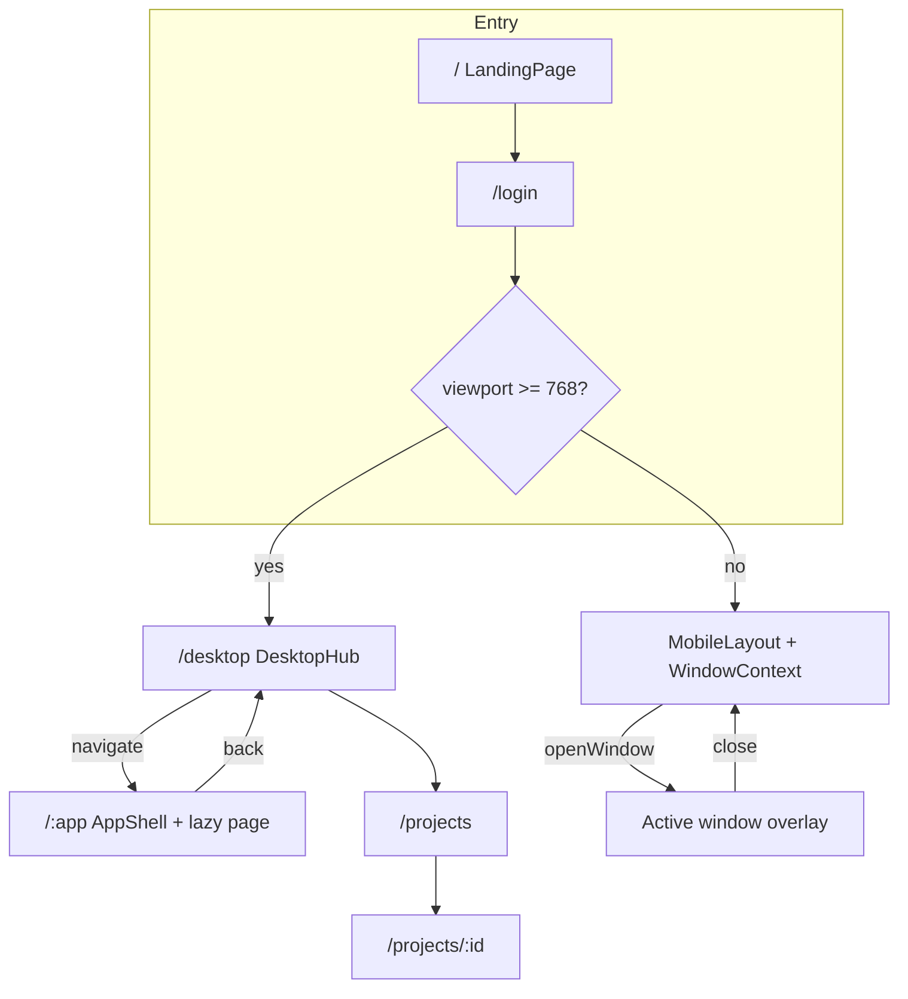

# Fullscreen Apps Redesign - Plan

## Goal Capsule

On large screens, replace the stacked mock-OS window manager with full-screen route pages. On small screens, keep the existing window-based `MobileLayout` experience. Fix known functional bugs and apply straightforward performance cuts while preserving the portfolio's desktop-hub identity.

**Authority:** User request (session) > this plan > existing code patterns. Prefer the existing dark OS visual language over a brand reboot.

**Product Contract preservation:** Changed R1/R3/R5/R9 and added R11 after user redirect — small screens keep windows; desktop-only full-screen routes.

**Stop when:** Desktop apps open as dedicated full-screen URLs with only one content page mounted; small-screen apps still open via the window/`MobileLayout` model; listed bugs are fixed; always-on desktop effects are gated off desktop app routes; unit + e2e tests pass for both shells; README matches reality.

**Execution profile:** Code implementation via `ce-work` (or equivalent). Prefer smoke/runtime proof for shell/routing units; characterization-first for MusicPlayer and e2e login flow before rewriting expectations.

---

## Product Contract

### Summary

The site is a mock-OS personal portfolio. Today every app opens as a draggable/resizable window on desktop (costly) and as an iOS-style window overlay on mobile via `MobileLayout`. This plan switches **large-screen** navigation to full-screen pages (routes), **keeps windows on small screens**, fixes obvious broken assets and logic, and removes cheap performance waste.

### Problem Frame

Stacked windows look like an OS demo but cost real FPS: Window drag writes React state every `mousemove`, DesktopOS rebuilds every page element each render, GlassSurface + FallingParticles keep running under open apps, and all page modules are eagerly imported into the main chunk. Several features are also broken (window positioning double-offset, missing resume PDF, Deezer proxy gap, flaky e2e, incorrect album cover path).

### Requirements

- R1. On large screens (existing breakpoint: `innerWidth >= 768`), opening an app navigates to a dedicated full-screen page/route instead of stacking a floating OS window.
- R2. On large screens, closing or leaving an app returns to the desktop/home hub without leaving orphan desktop window state.
- R3. On large screens, at most one portfolio content app is mounted at a time.
- R4. Landing → login/name → desktop/mobile entry flow remains reachable and completes reliably in automated tests.
- R5. On large screens, dock, desktop icons, terminal open-app commands, suggestions, and file-explorer mappings open full-screen routes.
- R6. On large screens, project detail opens as a nested full-screen route (e.g. `/projects/:id`), not a cloned window element.
- R7. Fix known functional bugs: desktop window position double-offset (removed with desktop windows), broken resume PDF link, album cover path, fileToAppMap fallback, dock double-open sound, MobileLayout `whileTap` on plain button, MusicPlayer unit test providers/copy, Deezer local API reachability, e2e click/login timing.
- R8. Apply straightforward performance improvements: route-level code splitting for desktop app pages, gate or remove always-on FallingParticles under desktop app routes, stop SuggestionsCarousel autoplay under desktop app routes, disable visualizer auto-open, drop unused heavy deps when safe, simplify/remove ineffective PreRender path if it adds no value. Mobile keeps lightweight window UX; still avoid unnecessary always-on cost where easy (e.g. do not remount every page on every unrelated state tick).
- R9. Preserve mock-OS visual identity: desktop hub (wallpaper, dock, icons, menu bar) + full-bleed desktop app chrome; small-screen keeps the existing window/`MobileLayout` OS feel.
- R10. Update unit tests, Playwright e2e, and README so documented structure and interactions match the dual-shell UX.
- R11. On small screens (`innerWidth < 768`), apps continue to open through the window-based `MobileLayout` + `WindowContext` model (not desktop-style full-screen routes). session-settled: user-directed — chosen over unifying mobile onto routes.

### Actors

- A1. Visitor — browses portfolio through landing, login, desktop hub, and app pages.
- A2. Implementer / CI — runs Vitest and Playwright; expects stable selectors and routes.

### Key Flows

- F1. Entry to hub
  - **Trigger:** Visitor loads `/`
  - **Actors:** A1
  - **Steps:** Landing completes → login/name → navigate to desktop hub route
  - **Outcome:** Hub visible with icons/dock; no content app mounted yet
  - **Covered by:** R4, R9

- F2. Open app full screen (large screen)
  - **Trigger:** Click dock item, desktop icon, suggestion, or terminal command on a large viewport
  - **Actors:** A1
  - **Steps:** Navigate to `/about` (or peer route); hub chrome replaced or overlaid by full-screen app shell; page lazy-loads
  - **Outcome:** Single full-screen app; URL shareable/refreshable for that app
  - **Covered by:** R1, R3, R5, R8

- F3. Leave app (large screen)
  - **Trigger:** Back/close control or navigate home
  - **Actors:** A1
  - **Steps:** Navigate to hub route; app unmounts
  - **Outcome:** Hub restored; no desktop window stack residual
  - **Covered by:** R2, R3

- F4. Open project detail (large screen)
  - **Trigger:** Select a project from Projects
  - **Actors:** A1
  - **Steps:** Navigate to `/projects/:id` full screen
  - **Outcome:** Detail page only; closing returns to `/projects` or hub (implementer picks one and documents it)
  - **Covered by:** R6

- F5. Open app on small screen
  - **Trigger:** Tap an app on `MobileLayout`
  - **Actors:** A1
  - **Steps:** `openWindow` / existing mobile window path shows the app in the mobile window overlay
  - **Outcome:** Window-based mobile UX preserved; not forced through desktop full-screen routes
  - **Covered by:** R11

### Acceptance Examples

- AE1. Covers F2 / R1. Given a large-screen desktop hub, when the visitor clicks About, then the URL becomes `/about`, About content fills the viewport, and no floating window chrome with drag handles is present.
- AE2. Covers F3 / R2. Given large-screen `/projects`, when the visitor activates close/back-to-home, then the URL is the hub route and Projects is unmounted.
- AE3. Covers R7. Given MusicPlayer favorites, when album art for the Moo track renders, then it loads `/Moo.png` successfully.
- AE4. Covers R4 / R10. Given a cold Playwright run, when the suite boots through landing/login, then it reaches the hub without relying on brittle fixed double-click + 2s sleeps alone.
- AE5. Covers F5 / R11. Given a small viewport (`< 768`), when the visitor opens About, then the app appears via `MobileLayout` window overlay (not a desktop-style route-only shell that abandons windows).

### Success Criteria

- Large-screen apps are route pages, not stacked floating windows.
- Small-screen apps still use the window-based mobile shell.
- Main-bundle no longer eagerly ships every page component for the desktop path.
- Listed bugs in R7 are gone or explicitly deferred with reason.
- `npm run test:run` and `npm run test:e2e` pass (or e2e skip only with documented env blocker).
- README describes dual shell (desktop routes + mobile windows), not StartMenu/FontDemo phantoms.

### Scope Boundaries

**In scope**
- Router introduction and route map for entry + desktop apps + project detail
- Retirement of **desktop** multi-window drag/resize/z-index stacking
- Retention of `WindowContext` + `MobileLayout` window UX for small screens
- Full-screen desktop app shell redesign (hub preserved, app pages full-bleed)
- Bug fixes listed in R7
- Straightforward perf cuts listed in R8
- Test + README alignment

**Out of scope**
- Full brand reboot / new color system unrelated to the OS identity
- Rebuilding File Explorer into a real filesystem browser (keep stub or redirect to hub Files affordance)
- New content writing for About/Projects/etc. beyond layout wrappers needed for full-screen
- Forcing mobile onto the same full-screen route model as desktop
- Spotify proxy revival
- Three.js scene work beyond existing LiquidEther on login
- PWA / SSR / Next.js migration

### Deferred to Follow-Up Work

- Rich File Explorer implementation
- Optional deep-link skip of landing for returning visitors
- GSAP SplitText Club plugin licensing fallback if landing blocks progression in some environments
- Media asset compression pass for large wallpapers / Paradise.mp3

---

## Planning Contract

### Assumptions

Headless planning run — scoping confirmation skipped. Inferred bets recorded here (updated after user redirect: keep windows on small screens):

- Keep the desktop hub as a first-class route (e.g. `/desktop` or `/home`) after login on large screens; do not jump straight into a random app.
- Preserve existing dark teal/emerald OS aesthetic; redesign means architecture + shell polish + clutter reduction, not a new brand.
- Install React Router for SPA routes (`react-router` / compatible DOM bindings). Prefer declarative `BrowserRouter` + nested `Routes`/`Outlet` with `React.lazy` — portfolio pages need no loaders.
- **Breakpoint stays `768px`** (matches current `DesktopOS` check). Large = desktop routes; small = `MobileLayout` + windows.
- Shared providers wrap both shells. Page components stay shared; launch path differs by viewport.
- On resize across the breakpoint, prefer a simple remount of the active shell (current behavior) over perfect state migration; document if janky.
- Music continues globally via `MusicContext` across desktop route changes unless current product behavior already stops on unmount — preserve whichever is less surprising after checking `MusicContext`.
- File Explorer dock entry either routes (desktop) or opens via window (mobile); do not rebuild the stub.
- Visual redesign of content sections is limited to desktop full-screen layout chrome; keep page internals unless they break.

### Key Technical Decisions

- KTD1. **Large-screen: replace window stack with URL routes.** session-settled: user-directed — chosen over keeping stacked OS windows on desktop. Rationale: user asked for full-screen pages to preserve performance on the costly drag/multi-mount path.
- KTD2. **Small-screen: keep window-based `MobileLayout`.** session-settled: user-directed — chosen over unifying mobile onto routes. Rationale: user explicitly requires windows on small screens; existing mobile shell already presents one active window overlay and matches the OS metaphor on phones.
- KTD3. **Hub + full-screen app layout (desktop only).** `/` landing, `/login`, `/desktop` hub; app routes like `/about`, `/projects`, `/projects/:id`, etc. App routes render shared `AppShell` (title, back/close) with `<Outlet />`. Mobile does not use these app routes for open/close; it uses `openWindow` / `closeWindow`.
- KTD4. **Lazy page modules** for desktop route boundaries (`React.lazy` / router `lazy`). Mobile may still instantiate the active page through the apps registry — prefer lazy factories shared by both shells so mobile does not reintroduce an eager mega-bundle.
- KTD5. **Keep `WindowContext` for mobile; stop using it for desktop app chrome.** Desktop Dock "isOpen" becomes path match; Terminal/`Projects` on desktop navigate. Mobile continues `onAppClick` → `openWindow`. Delete desktop-only `Window.jsx` drag/resize path once unused; do not delete window state APIs still required by `MobileLayout`.
- KTD6. **Gate always-on desktop effects to hub only.** FallingParticles and SuggestionsCarousel mount on large-screen `/desktop` (and maybe login), not under desktop app routes. Mobile may keep its current particle usage unless an easy win appears; do not regress mobile UX for micro-gains.
- KTD7. **Bug fix batch after routing skeleton.** Desktop double-position dies with desktop `Window.jsx` removal; mobile-specific bugs (`whileTap`) stay in scope.
- KTD8. **Add Vite dev proxy for `/api/deezer`** so MusicPlayer search works outside Vercel.

### Alternative Approaches Considered

| Approach | Pros | Cons | Verdict |
|----------|------|------|---------|
| A. Desktop routes + mobile windows (chosen) | Fixes desktop perf; honors small-screen windows | Two launch paths to maintain | **Choose** — matches latest user direction |
| B. Routes everywhere (prior draft) | One navigation model | Drops mobile windows | Reject — user redirected |
| C. Keep windows, always maximize on desktop | Smaller code change | Still remounts on drag; GlassSurface N; no URLs | Reject for desktop |
| D. Migrate to Next.js App Router | Framework splitting/SSR | Out of scope rewrite | Reject / defer |

### High-Level Technical Design

Desktop hub keeps wallpaper + dock + icons. Desktop AppShell is full-viewport with compact top bar (close → hub). Small screens keep `MobileLayout` window overlays and `WindowContext`.

### Implementation Constraints

- Repo-relative paths only in implementer notes.
- Do not hardcode test assertions that invent new copy — pull visible strings/selectors from components under test.
- Preserve existing design-system cues (GlassSurface on hub controls is fine; avoid wrapping every full-screen page in heavy SVG displacement filters).
- No exploit/malware work; Deezer proxy is a same-origin forwarder only.

### Sequencing

1. Router + desktop route map + providers (U1)
2. Desktop launchers → navigate; keep WindowContext for mobile (U2)
3. Desktop AppShell redesign + effect gating (U3)
4. Bug fixes + Vite proxy + dependency cleanup (U4)
5. Tests + README for dual shell (U5)

---

## Implementation Units

### U1. Introduce router and desktop route map

**Goal:** Add SPA routing for landing, login, desktop hub, and lazy desktop app routes. Keep `WindowProvider` available for the mobile shell.

**Requirements:** R1, R4, R6, R11

**Dependencies:** None

**Files:**
- `package.json` (add `react-router` / DOM bindings)
- `src/main.jsx`
- `src/App.jsx` (or split `src/routes.jsx`, `src/layouts/DesktopHub.jsx`, `src/layouts/AppShell.jsx`)
- `src/pages/*` (default exports remain; may add thin route wrappers)
- `src/contexts/WindowContext.jsx` (retain provider wiring)

**Approach:**
- Install current React Router package compatible with React 19 + Vite 7.
- Wrap app in `BrowserRouter` (or `RouterProvider` if using data router). Prefer declarative routes because pages are static.
- Map entry flow from `currentPage` state to routes; login success `navigate('/desktop')`.
- Register lazy routes for each app id for **desktop** use; Suspense fallback matches dark theme.
- Nested route for `/projects/:id`.
- Viewport gate: large screens render desktop hub/routes; small screens render `MobileLayout` still backed by windows.

**Patterns to follow:** Existing lazy pattern in `LoginPage.jsx` for LiquidEther; provider nesting in `App.jsx`; existing `innerWidth < 768` split.

**Test scenarios:**
- Happy: visiting `/desktop` after login on large viewport renders hub markers (About/Projects labels).
- Happy: visiting `/about` on large viewport renders About full screen.
- Happy: small viewport still reaches `MobileLayout` after login.
- Edge: unknown desktop path shows minimal not-found or redirect to hub.
- Integration: refresh on `/resume` (large) still shows Resume (providers wrap router).

**Verification:** Dev server: desktop navigation works for hub + two app routes; mobile still opens an app as a window overlay; build succeeds.

**Execution note:** Prefer runtime smoke after wiring routes before deleting desktop-only window chrome.

---

### U2. Desktop launchers navigate; mobile keeps windows

**Goal:** On large screens, remove multi-window open/drag/resize/z-index app chrome. On small screens, keep `MobileLayout` + `WindowContext` open/close behavior.

**Requirements:** R1, R2, R3, R5, R6, R11

**Dependencies:** U1

**Files:**
- `src/contexts/WindowContext.jsx` (keep for mobile; stop desktop consumers of drag/resize if unused)
- `src/contexts/useWindows.js`
- `src/components/Window.jsx` (remove desktop usage; delete if no remaining callers)
- `src/App.jsx`
- `src/components/Dock.jsx`
- `src/components/MenuBar.jsx`
- `src/components/GlassIcons.jsx` / desktop hub
- `src/components/MobileLayout.jsx` (preserve window props API)
- `src/components/Terminal.jsx`
- `src/components/SuggestionsCarousel.jsx`
- `src/pages/Suggestions.jsx`
- `src/pages/Projects.jsx`
- `src/components/ProjectDetail.jsx`
- `src/components/FileExplorer.jsx` (routing on desktop only)

**Approach:**
- Desktop `handleAppClick` → `navigate(\`/${app.id}\`)`.
- Mobile `handleAppClick` → existing `openWindow` / restore / bring-to-front.
- Desktop Dock active state: `useLocation().pathname`.
- Desktop close: `navigate('/desktop')`.
- Desktop Projects: `navigate(\`/projects/${id}\`)`; mobile project detail may keep window open path (or a mobile-friendly window) — do not break small-screen project viewing.
- Fix `fileToAppMap` fallback to resolve **values** (app types), then branch navigate vs openWindow by viewport.
- Wire or remove dead `onOpenFolder` path in Projects.
- Do **not** remove `WindowProvider` while `MobileLayout` needs it.

**Patterns to follow:** Current `apps` registry; existing mobile active-window selection in `MobileLayout.jsx`.

**Test scenarios:**
- Happy: desktop dock click changes location and mounts one page.
- Happy: mobile app tap opens window overlay; close returns to home grid.
- Happy: desktop terminal open-app navigates; mobile terminal (if reachable) still opens via windows or documented behavior.
- Happy: desktop project card opens `/projects/:id`.
- Edge: resizing across 768 remounts the appropriate shell without crash.
- Integration: AE5 — small viewport never depends on desktop AppShell-only close controls.

**Verification:** Desktop has no `updateWindowPosition` call sites; mobile still calls `openWindow`/`closeWindow`; manual open/close works on both shells.

---

### U3. Desktop AppShell redesign and effect gating

**Goal:** Deliver the desktop full-bleed app chrome redesign and cut always-on effects off the desktop critical path when an app route is open. Leave mobile window chrome intact.

**Requirements:** R8, R9, R11

**Dependencies:** U2

**Files:**
- `src/layouts/AppShell.jsx` (create) or equivalent in `src/components/`
- `src/App.css` / `src/index.css` (shell tokens only as needed)
- `src/components/FallingParticles.jsx` (desktop mount site)
- `src/components/SuggestionsCarousel.jsx` (desktop mount site)
- `src/components/ClickSparkCursor.jsx` (desktop mount site)
- `src/contexts/PreRenderContext.jsx` (simplify/remove if proven useless)
- `src/components/GlassSurface.jsx` (usage sites — avoid full-page wrap on desktop routes)
- `src/components/MobileLayout.jsx` (no regressions to window overlay chrome)

**Approach:**
- Desktop AppShell: full viewport, compact top bar with close→hub, title from route meta, content scroll region; no drag/resize; prefer light backdrop over per-page GlassSurface SVG filters.
- Desktop hub retains wallpaper, dock, icons, menu bar.
- Mount FallingParticles / SuggestionsCarousel / ClickSpark only on desktop hub (and login if desired), not under desktop app routes.
- Do not strip mobile particles solely for symmetry if that regresses the small-screen feel.
- Evaluate PreRenderContext: if theatrical only, remove provider and simplify consumers.
- Keep 2–3 intentional motions on desktop route enter/exit — avoid motion noise.

**Patterns to follow:** Existing MenuBar/Dock visual language; preserve teal/gold accents; keep `MobileLayout` window presentation.

**Test scenarios:**
- Happy: desktop app route has back/close returning to hub.
- Happy: desktop hub may show particles; desktop `/about` does not mount FallingParticles.
- Happy: small-screen window overlay still opens/closes after shell polish.
- Test expectation for pure styling: none beyond smoke — visual check at desktop and mobile widths.

**Verification:** Desktop app pages feel full-screen; no particle canvas under desktop `/about`; mobile windows still work.

---

### U4. Bug fixes and straightforward build/runtime perf cleanup

**Goal:** Clear remaining R7 bugs and easy package/build wins that do not depend on more architecture debate.

**Requirements:** R7, R8

**Dependencies:** U1 (proxy), U2 (some bugs obsolete)

**Files:**
- `src/pages/Resume.jsx` (PDF href — add asset under `public/` or fix path to an existing file)
- `src/pages/MusicPlayer.jsx` (`/Moo.png`)
- `src/pages/MusicPlayer.test.jsx`
- `src/components/MobileLayout.jsx` (`motion.button` for `whileTap`)
- `src/components/Dock.jsx` (single open sound)
- `src/components/Window.jsx` (desktop-only removal in U2 — double position dies with desktop windows)
- `vite.config.js` (Deezer proxy; visualizer `open: false`)
- `api/deezer.js` (reference for proxy target)
- `package.json` (remove unused deps if unused: `@react-three/*`, `maath`, `use-sound`, unused `motion` package if distinct from framer-motion; remove broken `spotify-proxy` script or restore file — prefer remove script)
- `public/` as needed for resume PDF

**Approach:**
- Fix asset paths; ensure resume download target exists or hide broken CTA.
- Wrap MusicPlayer tests with required providers; align empty-state assertion with component string **from the component**.
- Dev-server proxy `/api/deezer` so local search works.
- Drop dead dependencies only after grep confirms zero imports.
- Do not invent new MusicPlayer empty-state copy in tests.

**Patterns to follow:** Existing `SoundContext.test.jsx` provider wrapping; Vercel `api/deezer.js` request/response shape.

**Test scenarios:**
- Happy: MusicPlayer test renders under MusicProvider without throw.
- Happy: Moo favorite image `src` is `/Moo.png`.
- Happy: Deezer search in dev hits proxied `/api/deezer` (mock network or smoke).
- Error: missing resume asset — either file present or button not linking 404.
- Edge: dock open sound fires once per open.

**Verification:** `npm run test:run` green for touched tests; `npm run build` does not auto-open stats.html; bundle analyzer file may still emit to `dist/stats.html`.

**Execution note:** Characterization-first for MusicPlayer tests — observe current failure, then fix providers/assertions against real UI strings.

---

### U5. Align e2e suite and README with route-based UX

**Goal:** Make automated entry + app open reliable; documentation matches the redesign.

**Requirements:** R4, R10

**Dependencies:** U2, U3, U4

**Files:**
- `e2e/app.spec.js`
- `e2e/music-player.spec.js`
- `README.md`
- optionally `playwright.config.js` if baseURL/timeouts need tuning

**Approach:**
- Replace dblclick with single click; wait on URL (`/desktop`, `/music`) and role/text from real UI instead of fixed multi-second sleeps where possible.
- Stabilize login/name: explicit waits for Login button → name field → hub landmark.
- Rewrite README: remove Font Demo / StartMenu / Taskbar / DesktopIcon / Google Font list fiction; document **desktop routes + mobile windows**, env keys, scripts that exist.
- Keep tests pulling locators from visible labels already in components.
- Add or adjust at least one mobile-viewport check that an app opens as a window overlay (Playwright `setViewportSize`).

**Test scenarios:**
- Happy: e2e reaches hub and opens Music via single click; URL is `/music` on desktop viewport.
- Happy: desktop icons visible on hub.
- Happy: mobile viewport opens an app via window UI (AE5).
- Integration: music search test skips gracefully or mocks API if proxy unavailable — document choice in test.
- Edge: landing-only test does not require full desktop boot if isolated.

**Verification:** `npm run test:e2e` passes locally in this environment (or failures are env-only and called out); README documents dual shell.

---

## Verification Contract

| Gate | Command / check | Proves |
|------|-----------------|--------|
| Unit | `npm run test:run` | MusicPlayer/SoundContext and any new route helper tests |
| Lint | `npm run lint` | No new eslint errors in touched files |
| Build | `npm run build` | Route lazy splits; visualizer does not block CI with `open: true` |
| E2E | `npm run test:e2e` | Entry flow + open app via routes |
| Manual smoke (desktop) | Dev large viewport: hub → open About/Projects/Music → back → project detail | R1–R6, R9 |
| Manual smoke (mobile) | Dev `<768`: open/close apps via MobileLayout windows | R11 |
| Perf smoke | Confirm no FallingParticles canvas on desktop app route; network tab shows separate page chunks | R8 |

**Behavioral skill evaluation:** not required (no agent/tool surface).

**Release validate:** not applicable (static Vite portfolio).

---

## Definition of Done

- All Implementation Units U1–U5 complete with their verification outcomes.
- Product requirements R1–R10 satisfied or explicitly deferred under Scope Boundaries with reason.
- Desktop window stacking/drag APIs gone from the large-screen path; desktop apps are full-screen routes.
- Small-screen `WindowContext` + `MobileLayout` window path remains intentional and working (R11).
- Obvious bugs in R7 fixed.
- Tests and README updated; dual shell is deliberate, not an abandoned half-migration.
- Abandoned experiment code from implementation attempts removed from the diff.

---

## Risks & Dependencies

| Risk | Mitigation |
|------|------------|
| GSAP SplitText Club plugin blocks landing → login in some installs | E2E should timeout-fail clearly; consider try/catch fallback calling `onComplete` if already partially present — only if reproduced |
| Music audio UX across unmount | Inspect `MusicContext` before deciding stop-vs-continue; document choice in AppShell notes |
| Deezer CORS/API key behavior differs local vs Vercel | Proxy mirrors `api/deezer.js`; e2e mocks search if needed |
| Large PR touching shell + tests | Keep unit order U1→U5; prefer incremental commits per unit |

**External research (load-bearing):** React Router v7 route-level `lazy` / Vite code-splitting guidance informed KTD4 ([React Router route `lazy`](https://reactrouter.com/7.6.1/start/data/route-object)); portfolio needs no loaders, so declarative + `React.lazy` is sufficient.

---

## System-Wide Impact

- **Navigation model:** large screens move to URL routes (bookmarkable apps); small screens keep window state.
- **Performance posture:** one mounted desktop app; desktop hub-only particles; smaller initial JS via lazy pages.
- **Tests:** Playwright covers desktop routes and mobile window open.
- **Docs:** README becomes source of truth for the dual shell.

---

## Open Questions

None blocking. Deferred non-blocking items live under Scope Boundaries → Deferred to Follow-Up Work.

---

## Sources & Research

- Codebase exploration of `src/App.jsx`, `src/contexts/WindowContext.jsx`, `src/components/Window.jsx`, `MobileLayout.jsx`, `FallingParticles.jsx`, `LoginPage.jsx`, `vite.config.js`, e2e specs, `package.json`
- Evidence: double `x/y` + `left/top` positioning in `Window.jsx`; eager page imports in `App.jsx`; no `react-router` usage; Deezer path `/api/deezer` without Vite proxy; README/feature drift
- React Router lazy route docs (external, load-bearing for KTD4)
- User redirect: keep windows on small screens (R11 / KTD2)
