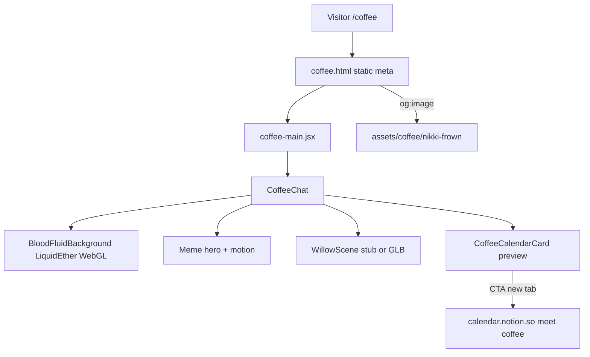

# feat: Obsession coffee chat landing

## Goal Capsule

Ship a standalone `/coffee` page on the portfolio that feels like an Obsession meme tribute: campy, blood-soaked WebGL atmosphere, One Wish Willow presence, and a clear path to book a coffee chat via the existing Notion Calendar meet link. Shareable link previews use the Nikki frown still as `og:image`.

**Authority:** User request (session) > this plan > existing portfolio patterns.

**Product Contract preservation:** N/A — `product_contract_source: ce-plan-bootstrap`.

**Stop when:** `/coffee` loads outside the mock-OS shell; WebGL blood fluid runs (with reduced-motion fallback); hero meme copy + calendar CTA work; OG/Twitter meta resolve for `/coffee` with Nikki frown; willow mount stub ready for the user’s 3D asset; unit + e2e coverage for route/CTA/meta shell.

**Execution profile:** Code via scaffolding then `ce-work`. Smoke-first for WebGL + OG; unit-test CTA and route isolation with WebGL mocked.

---

## Product Contract

### Summary

Visitors book coffee chats through a themed landing page inspired by Curry Barker’s *Obsession* (2026) meme culture — especially Nikki’s “No no no… I thought we were having a nice date!” breakdown — reframed as a coffee chat. Notion Calendar remains the booking backend; the themed page owns atmosphere, humor, and link preview.

### Problem Frame

The Notion meet URL (`https://calendar.notion.so/meet/shourya0523/coffee`) cannot host custom React theming, and its CSP `frame-ancestors` blocks embedding on external sites. A portfolio-hosted `/coffee` experience is required so the vibe lives on a controllable URL while booking still happens on Notion.

### Requirements

- R1. Standalone `/coffee` experience that does **not** enter landing → login → desktop OS shell.
- R2. Visual theme is Obsession / “Freaky Nikki” meme-camp (funny + horror aesthetic), not a straight trauma retelling of the film’s consent themes.
- R3. Hero wordplay centers on: “No no no no no… Don’t do that! We were having such a nice ~~date~~ coffee chat.”
- R4. Additional meme callouts appear as secondary copy/microinteractions: Nikki frown reaction, “Why don’t you love me?”, “I’m your freaky Nikki”, One Wish Willow / “wishes can’t be cancelled.”
- R5. Full-viewport WebGL liquid blood fluid (pointer-reactive), with `prefers-reduced-motion` static fallback.
- R6. User-supplied stills: Nikki frown for in-page + **link preview (`og:image` / Twitter card)**; Bear terror still for in-page reaction art.
- R7. Forthcoming user 3D One Wish Willow asset mounts in a dedicated scene region (stub until file arrives).
- R8. Booking: styled Notion calendar **preview card** + primary CTA that opens the meet URL in a new tab (`target="_blank"` `rel="noopener noreferrer"`). No iframe of Notion.
- R9. Accurate per-route meta: title, description, `og:*`, `twitter:*` for `/coffee` that crawlers can read without executing the SPA.
- R10. Mobile + desktop first viewport readable; one composition (not a dashboard).
- R11. Tests cover route isolation, CTA href/target, and absence of OS chrome.

### Actors

- A1. Coffee-chat invitee — lands on `/coffee`, laughs, books via Notion.
- A2. Sharer — pastes `/coffee` into chat/social and sees Nikki OG preview.
- A3. Implementer / CI — Vitest + Playwright.

### Key Flows

- F1. Open themed page
  - **Trigger:** Visit `/coffee`
  - **Steps:** Serve coffee HTML entry → mount CoffeeChat only → WebGL blood (or reduced-motion fallback) → hero + CTA
  - **Outcome:** No OS shell; thematic page ready
  - **Covered by:** R1, R5, R10

- F2. Book coffee
  - **Trigger:** Click primary CTA (or preview card action)
  - **Steps:** Open Notion meet URL in new tab
  - **Outcome:** Notion scheduler available; themed page remains
  - **Covered by:** R8

- F3. Link preview
  - **Trigger:** Share `/coffee` URL
  - **Steps:** Crawler reads static meta from coffee HTML entry; `og:image` = Nikki frown asset
  - **Outcome:** Accurate Obsession-themed preview card
  - **Covered by:** R6, R9

### Acceptance Examples

- AE1. Visiting `/coffee` never shows the portfolio login button or dock.
- AE2. CTA `href` is exactly `https://calendar.notion.so/meet/shourya0523/coffee` and opens externally.
- AE3. View-source / crawler fetch of `/coffee` includes Nikki `og:image` and coffee-chat title/description (not the generic portfolio meta).
- AE4. With `prefers-reduced-motion: reduce`, page remains usable without continuous fluid simulation.
- AE5. Hero includes strikethrough “date” → “coffee chat” gag tied to the Obsession meme line.

### Scope Boundaries

**In scope**
- `/coffee` landing, WebGL blood, meme copy/motion, stills, willow stub, Notion CTA preview, OG entry, tests, deploy rewrite for `/coffee`

**Out of scope**
- Customizing Notion-hosted meet UI beyond its native description field
- Replacing Notion with Calendly/other (session-settled: keep Notion)
- Full mock-OS coffee “app window”
- Shipping audio of copyrighted film dialogue by default (optional mute-safe SFX later)

### Deferred to Follow-Up Work
- Drop-in final willow GLB/OBJ when user provides it
- Optional Contact/dock deep-link to `/coffee`
- Optional richer green-screen meme clip (video) if rights allow

---

## Planning Contract

### Assumptions

- User will place supplied stills at `public/assets/coffee/nikki-frown.jpg` and `public/assets/coffee/bear-terror.jpg` (or `.png`) if not already in the repo at implementation time.
- Absolute OG image URL uses the production site origin; local preview may show relative paths until deploy.
- Fan-homage personal page using user-provided promotional stills; no scraping of Google Images in CI.
- session-settled: user-directed — WebGL fluid blood (not canvas metaballs); Nikki frown as preview; Notion link-out; campy meme tone.

### Key Technical Decisions

- KTD1. Path isolation via Vite multi-page entry `coffee.html` + thin `src/coffee-main.jsx`, short-circuiting the OS `App` tree. (session-settled: user-directed — standalone page chosen over OS window)
- KTD2. Blood fluid: wrap/adapt existing WebGL `LiquidEther` into `BloodFluidBackground` with a dark-crimson palette and higher viscosity for “blood,” plus optional auto-splat; keep R3F available for willow. Chosen over new npm fluid packages for scaffold speed and because LiquidEther is already a viscous WebGL solver in-repo. Escalate to `@whatisjery/react-fluid-distortion` only if LiquidEther cannot read as blood.
- KTD3. Notion booking is link-out + styled preview card (CSP blocks iframes: `frame-ancestors` limited to Notion app origins).
- KTD4. OG meta lives in static `coffee.html` (crawlers do not run the SPA). Deploy rewrite maps `/coffee` → `coffee.html`.
- KTD5. Willow: lazy R3F `<Canvas>` stub with placeholder; load GLB via `useGLTF` when asset lands under `public/models/willow/`.
- KTD6. Typography/atmosphere: expressive non-default fonts (avoid Inter/Roboto); CSS variables for blood crimson, willow green-black, paper-cream accent; vignette + subtle film grain CSS — not purple AI-default kitsch.

### High-Level Technical Design

### Alternative Approaches Considered

| Approach | Why not |
|----------|---------|
| Iframe Notion meet page | Blocked by CSP `frame-ancestors` |
| Theme Notion meet page itself | No custom HTML/CSS support beyond description |
| Canvas metaball blood only | Rejected — user chose WebGL-focused fluid |
| Full React Router now | Useful later with fullscreen-apps plan; MPA entry is enough for one promo route |

---

## Implementation Units

### U1. Coffee HTML entry + deploy rewrite + asset slots

**Goal:** Crawler-readable `/coffee` shell with accurate meta and asset paths for Nikki/Bear stills.

**Requirements:** R6, R9, AE3

**Dependencies:** None

**Files:**
- Create: `coffee.html`
- Create: `src/coffee-main.jsx`
- Modify: `vite.config.js` (multi-page `input`)
- Create: `vercel.json` (or `public/_redirects`) rewrite `/coffee` → `coffee.html`
- Create: `public/assets/coffee/README.md` (expected filenames)
- Create: placeholder or committed user stills at `public/assets/coffee/nikki-frown.jpg`, `public/assets/coffee/bear-terror.jpg`

**Approach:** Static meta title/description/OG/Twitter pointing at Nikki image; `coffee-main.jsx` mounts only `CoffeeChat`. Document absolute `og:image` requirement for production domain.

**Test scenarios:**
- Happy path: built `coffee.html` contains `og:title`, `og:description`, `og:image` path including `nikki-frown`, and `twitter:card` = `summary_large_image`.
- Edge: trailing slash `/coffee/` still resolves via rewrite.
- Error: missing image file does not break HTML parse (broken preview only).

**Verification:** Build emits `dist/coffee.html`; rewrite config present; meta strings match coffee-chat copy (not portfolio defaults).

---

### U2. CoffeeChat page shell + meme hero + Notion preview CTA

**Goal:** Standalone themed page composition with hero gag and booking CTA.

**Requirements:** R1–R4, R8, R10, AE1, AE2, AE5

**Dependencies:** U1

**Files:**
- Create: `src/pages/CoffeeChat.jsx`
- Create: `src/pages/CoffeeChat.css` (CSS variables + atmosphere)
- Create: `src/components/CoffeeCalendarCard.jsx`
- Create: `src/pages/CoffeeChat.test.jsx`
- Create: `e2e/coffee-chat.spec.js`
- Modify: Contact copy optional later (out of this unit)

**Approach:** One hero composition: brand/signal (“Coffee Chat” / Obsession nod), one headline (meme line with strikethrough date), one support sentence, one CTA group, dominant blood plane behind. Secondary meme lines below fold or as hover/idle microcopy. Calendar card is a preview surface (thumbnail or styled faux-Notion card) linking out — not an iframe.

**Execution note:** Prefer smoke/runtime check for layout; unit-test CTA contract with motion/WebGL mocked.

**Patterns to follow:** `LoginPage.jsx` full-bleed overlay + Framer entrance; design rules: no hero cards-as-decoration, no pill-stat clutter.

**Test scenarios:**
- Happy path: CTA link href/target/rel correct; hero contains strikethrough date / coffee chat.
- Edge: narrow viewport still shows CTA without OS chrome.
- Integration: e2e `goto('/coffee')` asserts no dock/login; CTA visible.
- Covers AE1, AE2, AE5.

**Verification:** Unit + e2e green for CTA and shell isolation.

---

### U3. WebGL blood fluid background

**Goal:** Obsession-readable liquid blood atmosphere via WebGL.

**Requirements:** R5, AE4

**Dependencies:** U2 (mount point)

**Files:**
- Create: `src/components/BloodFluidBackground/BloodFluidBackground.jsx`
- Create: `src/components/BloodFluidBackground/BloodFluidBackground.css`
- Modify: `src/pages/CoffeeChat.jsx` (lazy Suspense mount)
- Modify: `src/pages/CoffeeChat.test.jsx` (mock background)

**Approach:** Thin wrapper around `LiquidEther` with blood palette (deep crimson / black-red / clot maroon), viscous settings, autoDemo splat, fixed full-viewport layer under content. Honor `prefers-reduced-motion` by skipping RAF fluid and showing static gradient vignette. Dispose on unmount (LiquidEther already does).

**Patterns to follow:** `LoginPage.jsx` lazy + Suspense + fallback gradient.

**Test scenarios:**
- Happy path: component renders container `data-testid="blood-fluid"` when motion allowed (mocked WebGL).
- Edge: reduced-motion path renders static fallback without throwing.
- Error: Suspense fallback visible while chunk loads.

**Verification:** Manual pointer-drag produces fluid motion; reduced-motion still readable; no leak of OS providers.

---

### U4. Stills, willow stub, polish motion

**Goal:** Wire Nikki/Bear imagery, willow placeholder/R3F stub, and 2–3 intentional motions.

**Requirements:** R4, R6, R7

**Dependencies:** U2, U3

**Files:**
- Create: `src/components/WillowScene.jsx`
- Modify: `src/pages/CoffeeChat.jsx`
- Create: `public/models/willow/.gitkeep` (+ README for expected GLB name)
- Assets under `public/assets/coffee/`

**Approach:** Nikki image used in OG (U1) and as a secondary visual (not overlaid badge spam on hero media). Bear still for “recoil” reaction near CTA cancel-adjacent humor if present. WillowScene: empty Canvas or simple branch placeholder until GLB; `useGLTF` when provided. Motions: hero text stagger, strikethrough reveal, CTA pulse/glitch sting — keep funny, not seizure-inducing.

**Test expectation:** none for pure asset drop — verify paths resolve in e2e image `src` or CSS background when images committed.

**Verification:** Missing willow does not crash; images 200 when present; motions respect reduced-motion.

---

## Verification Contract

- `npm run test:run` — CoffeeChat unit tests pass
- `npm run test:e2e` — `e2e/coffee-chat.spec.js` passes in isolation
- `npm run build` — emits `dist/index.html` and `dist/coffee.html`
- Manual: open `/coffee`, drag blood fluid, click CTA → Notion; share debugger / view-source confirms Nikki OG

## Definition of Done

- All R1–R11 addressed or explicitly deferred above
- U1–U4 landed with cited tests
- Notion remains booking backend; no iframe dependency
- User stills + willow slot documented; Nikki is preview image
- README note optional for `/coffee` share URL

## Sources & Research

- Notion Calendar meet CSP: `frame-ancestors https://app.notion.com https://app.dev.notion.com` — external iframe impossible
- Obsession memes (Know Your Meme / TV Tropes / TikTok trends): “No no no… nice date”, Nikki frown, “Why don’t you love me?”, “Freaky Nikki”, One Wish Willow
- Local WebGL precedent: `src/components/LiquidEther/LiquidEther.jsx` (viscous fluid); R3F installed but unused — reserved for willow
- Fluid libs surveyed: PavelDoGreat MIT WebGL Fluid, `@whatisjery/react-fluid-distortion`, `three-fluid-fx` — fallback if LiquidEther blood read fails
- Repo plan sibling: `docs/plans/2026-07-30-001-refactor-fullscreen-apps-redesign-plan.md` (future router; coffee stays outside OS)
